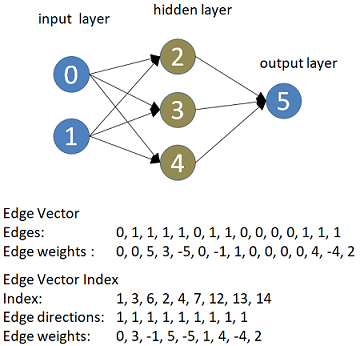

# Edge Vector representation

Edge Vector representation is a novel method of representing graphs. It was introduced in [1]. The advantage of this representation is the minimum requirement in memory usage, in comparison to competition. Also encoding a graph in Edge Vector or decoding the graph elements from the representation is efficient with polynomial complexity.

Use Edge Vector online Coder-Decoder [here.](https://rodispantelis.github.io/EdgeVector/index2.html)

In the [libraries](https://github.com/rodispantelis/EdgeVector/tree/main/libraries) there are coders / decoders implemented in Java and Javascript. Also included a Javascript library for converting files from Dimacs format to Edge Vector which is used as a benchmark.

In the randographs folder there is a web application for generating randomgraphs.

In the DIMACS folder there are graphs from the [Second DIMACS Implementation Challenge](http://archive.dimacs.rutgers.edu/Challenges/), they may be used as benchmark.

### Edge Vector for undirected graphs
Let $$s$$ be a vector that represents undirected graph $$G(V, E)$$, consisting of $$v$$ nodes. We further enumerate the elements of $$s$$ in the range 
$$[0, e)$$, where $$e = v(v-1) / 2$$ is the maximum possible number of edges in $$G$$.
The symbol in position $$q$$ of $$s$$ is $$w$$, if nodes $$a$$ and $$b$$ are adjacent and 0 if they are not adjacent, where  

(eq. 1) $$q=a+\sum_{x=0}^{b-1}x$$ , for $$a < b$$ and $$a, b \in [0, v)$$. 

The value of $$w$$ is set to 1 for non-weighted graphs, whereas for weighted graphs the respective value corresponds to the weight of the edge $$(a, b)$$.

### Edge vector for directed graphs
For directed graph $$G$$ the Edge Vector representation only differs on value $$w$$.
On non-weighted graphs, $$w=1$$ for $$a \to b$$, $$w=2$$ for $$b \gets a$$ and $$w=3$$ for $$a \leftrightarrow b$$.
For weighted graphs we form additional vector $$s_w$$ so that in position $$p$$ of $$s_w$$ we assign the weight of the edge denoted in position $$p$$ of $$s$$.
In the special case of bidirectinal edge $$(a, b)$$ in which different weights apply in each direction, $$s_w$$ is formatted as $$w_1 | w_2$$ where $$w_1$$ is the weight for $$(a, b)$$ and $$w_2$$ the weight for $$(b, a)$$.

### Edge Vector Index
Let $$i$$ be the array (or the tuple) that indexes the Edge Vector representation of graph $$G$$. 
For any edge $$e(a,b) \in E$$ we place in $$i$$ value $$q$$ as defined in eq. 1. On this way, the index that is produced does not contain redundant information about nonadjacent nodes. The order in which we index the edges in $$i$$ is not restrictive, we can use any indexing order that is appropriate for the problem under study.

An example of a small NN representation in Edge Vector Index is illustrated in next figure.

Directed edges are represented by array $$i_{dir}$$ so that in position $$p$$ of $$i_{dir}$$ we assign value 1, 2 or 3 as defined above that denotes the direction of the edge indexed in position $$p$$ of index $$i$$. Edge weights are denoted in array $$i_w$$ so that in position $$p$$ of $$i_w$$ we assign the weight of the edge denoted in position $$p$$ of $$i$$.

In the case of graph $$G$$ with weighted nodes, the node weights are stored in a *Node Weight Vector*. Therefore, in vector $$k:\langle w_0, w_1, …, w_v \rangle$$ the value $$w_n$$ represents the weight of node $$n$$. 

---

[1] P. Rodis and P. Papadimitriou, "Intelligent Network Service Embedding using Genetic Algorithms," *2021 IEEE Symposium on Computers and Communications (ISCC)*, 2021, pp. 1-7, 
[doi: 10.1109/ISCC53001.2021.9631456](https://doi.org/10.1109/ISCC53001.2021.9631456). [pdf.](https://pantelisrodis.appspot.com/papers/ISCC_2021.pdf)
